# Container Build Flow Action 🐳

[](https://github.com/marketplace/actions/container-build-flow-action) [](https://opensource.org/licenses/MIT) [](https://github.com/wgtechlabs/container-build-flow-action/releases) [](https://github.com/wgtechlabs)

> **Intelligent container build automation for modern development workflows.**  
> Automated Docker/Container builds with branch-aware tagging for Docker Hub and GitHub Container Registry.

Stop writing repetitive Docker build workflows. This GitHub Action automatically detects your branch context (PR, dev, patch, or WIP) and builds container images with intelligent tags—no configuration gymnastics required.

---

## 🎯 Why Use This Action?

**The Problem:**  
Building containers across multiple branches with different tagging strategies is repetitive and error-prone. Teams waste time writing similar workflows for PRs, development, staging, and production.

**The Solution:**  
One action that intelligently detects your workflow context and applies the right tags automatically. Whether it's a feature PR, a dev→main promotion, or an emergency hotfix, your containers get tagged correctly—every time.

---

## 🔍 How It Works

This action analyzes your GitHub workflow context and automatically determines the appropriate build flow:

```mermaid
graph LR
    A[Push/PR Event] --> B{Detect Context}
    B -->|PR → dev| C[pr-sha]
    B -->|dev → main| D[dev-sha]
    B -->|hotfix → main| E[patch-sha]
    B -->|push → main| F[staging-sha]
    B -->|other| G[wip-sha]
    C --> H[Build & Push]
    D --> H
    E --> H
    F --> H
    G --> H
    H --> I[PR Comment]
```



**No manual configuration needed.** Just add the action to your workflow, and it handles branch detection, tagging, building, and PR comments automatically for all flow types—whether triggered by pull requests or direct pushes to tracked branches.

---

## ✨ Features

- 🎯 **Intelligent Flow Detection** - Automatically detects PR context and assigns appropriate build tags
- 🐳 **Dual Registry Support** - Push to Docker Hub, GHCR, or both simultaneously
- 🏷️ **Smart Tagging Strategy** - `pr-{sha}`, `dev-{sha}`, `patch-{sha}`, `wip-{sha}` flows
- 🔧 **Highly Configurable** - Customize branches, registries, build options, and more
- 💬 **Smart PR Comments** - Automatic pull instructions posted to PRs for all flow types (push and pull_request events)
- 🚀 **Multi-Platform Builds** - Support for `linux/amd64`, `linux/arm64`, and more
- 🔐 **Security-First** - Built-in SBOM and provenance attestations
- 🔒 **Built-in Security Scanning** - Comprehensive vulnerability scanning with Trivy (source code, Dockerfile, and container images)
- ⚡ **Build Cache** - GitHub Actions cache integration for faster builds

---

## 💡 Before & After

<table>
<tr>
<th>❌ Without This Action</th>
<th>✅ With This Action</th>
</tr>
<tr>
<td>

```yaml
# Multiple jobs for different flows
build-pr:
  if: github.event_name == 'pull_request'
  steps:
    - run: docker build -t app:pr-$SHA .
    
build-dev:
  if: github.ref == 'refs/heads/dev'
  steps:
    - run: docker build -t app:dev-$SHA .
    
build-patch:
  if: contains(github.head_ref, 'hotfix')
  steps:
    - run: docker build -t app:patch-$SHA .

# ... 50+ lines of repetitive config
```

</td>
<td>

```yaml
# One job handles everything
build:
  steps:
    - uses: wgtechlabs/container-build-flow-action@v1
      with:
        dockerhub-username: ${{ secrets.DOCKERHUB_USERNAME }}
        dockerhub-token: ${{ secrets.DOCKERHUB_TOKEN }}

# Done! Automatically detects flow,
# builds, tags, and pushes correctly
```

</td>
</tr>
</table>

**Result:** Reduce workflow complexity by 80%+ while gaining automatic PR comments, multi-registry support, and intelligent tagging.

---

## 📋 Build Flow Types

All flow types use **commit SHA** (first 7 characters) for tagging, ensuring traceability back to the exact code that was built.

| Flow Type | Trigger | Tag Format | Use Case |
|-----------|---------|------------|----------|
| **PR** | Pull Request → `dev` branch | `pr-{sha}` | Feature development and testing |
| **DEV** | Pull Request from `dev` → `main` OR Push to `dev` branch | `dev-{sha}` | Development images |
| **PATCH** | Pull Request → `main` (not from `dev`) | `patch-{sha}` | Hotfixes and emergency patches |
| **STAGING** | Direct push to `main` branch (after PR merge) | `staging-{sha}` | Pre-production validation before release |
| **WIP** | Other branches/commits | `wip-{sha}` | Work in progress experiments |

> **Note:** The `{sha}` in each tag represents the **HEAD commit SHA** of the PR or push event, not the PR number. This ensures every build can be traced to its exact source code.

---

## 🏷️ Tagging Strategy

### Why Commit SHA?

Every image tag includes the commit SHA (first 7 characters) instead of PR numbers for several important reasons:

- **Traceability**: Directly links images to exact source code in Git history
- **Uniqueness**: Guarantees unique tags even across multiple PRs
- **Reproducibility**: Makes it easy to rebuild or debug specific versions
- **CI/CD Integration**: Works seamlessly with GitOps workflows

### Tag Format Examples

```bash
# Feature PR #42 with commit abc1234
myorg/myapp:pr-abc1234

# Dev branch with commit def5678
myorg/myapp:dev-def5678

# Staging build after merge to main with commit ghi9012
myorg/myapp:staging-ghi9012

# With custom prefix/suffix
myorg/myapp:v1-pr-abc1234-alpine
```

### Workflow Integration

```yaml
# In your deployment workflow, reference by SHA
- name: Deploy to Staging
  run: |
    docker pull myorg/myapp:staging-${{ github.sha:0:7 }}
    docker tag myorg/myapp:staging-${{ github.sha:0:7 }} myorg/myapp:latest
    # Deploy...
```

---

## 🚀 Quick Start

### Basic Usage

```yaml
name: Container Build

on:
  pull_request:
    branches: [main, dev]
  push:
    branches: [main, dev]

jobs:
  build:
    runs-on: ubuntu-latest
    steps:
      - uses: actions/checkout@v4
      
      - name: Build and Push Container
        uses: wgtechlabs/container-build-flow-action@v1
        with:
          dockerhub-username: ${{ secrets.DOCKERHUB_USERNAME }}
          dockerhub-token: ${{ secrets.DOCKERHUB_TOKEN }}
```

### Docker Hub Only

```yaml
- name: Build and Push to Docker Hub
  uses: wgtechlabs/container-build-flow-action@v1
  with:
    registry: docker-hub
    dockerhub-username: ${{ secrets.DOCKERHUB_USERNAME }}
    dockerhub-token: ${{ secrets.DOCKERHUB_TOKEN }}
```

### GHCR Only

```yaml
- name: Build and Push to GHCR
  uses: wgtechlabs/container-build-flow-action@v1
  with:
    registry: ghcr
    ghcr-token: ${{ secrets.GITHUB_TOKEN }}
```

### Custom Branch Names

```yaml
- name: Build with Custom Branches
  uses: wgtechlabs/container-build-flow-action@v1
  with:
    main-branch: production
    dev-branch: staging
    dockerhub-username: ${{ secrets.DOCKERHUB_USERNAME }}
    dockerhub-token: ${{ secrets.DOCKERHUB_TOKEN }}
```

### Multi-Platform Build

```yaml
- name: Multi-Platform Build
  uses: wgtechlabs/container-build-flow-action@v1
  with:
    platforms: linux/amd64,linux/arm64
    dockerhub-username: ${{ secrets.DOCKERHUB_USERNAME }}
    dockerhub-token: ${{ secrets.DOCKERHUB_TOKEN }}
```

### Advanced Configuration

```yaml
- name: Advanced Container Build
  uses: wgtechlabs/container-build-flow-action@v1
  with:
    # Registry
    registry: both
    dockerhub-username: ${{ secrets.DOCKERHUB_USERNAME }}
    dockerhub-token: ${{ secrets.DOCKERHUB_TOKEN }}
    
    # Branch Configuration
    main-branch: main
    dev-branch: dev
    
    # Build Configuration
    dockerfile: ./docker/Dockerfile
    context: .
    platforms: linux/amd64,linux/arm64
    build-args: |
      NODE_ENV=production
      VERSION=${{ github.sha }}
    
    # Tagging
    tag-prefix: v1-
    tag-suffix: -alpine
    
    # PR Comments
    pr-comment-enabled: true
    
    # Security
    provenance: true
    sbom: true
```

---

## 🔒 Security Scanning

This action includes comprehensive built-in security scanning using [Trivy](https://trivy.dev/), providing vulnerability detection for your container images, source code, and Dockerfiles—all enabled by default.

### 🎯 Features

- **🔍 Pre-Build Scanning**: Scan source code and Dockerfile before building
- **🐳 Container Image Scanning**: Scan final container images for vulnerabilities
- **📊 GitHub Security Integration**: Automatic SARIF upload to GitHub Security tab
- **💬 PR Comments**: Detailed vulnerability reports in pull request comments
- **📈 Baseline Comparison**: Compare vulnerabilities against baseline images
- **🚨 Fail on Vulnerabilities**: Optional build failure on security issues
- **⚡ Fast & Configurable**: Customizable severity levels, timeouts, and ignore patterns

### 🚀 Quick Start

**Default Behavior** - Security scanning is enabled automatically:

```yaml
- name: Build with Security Scanning
  uses: wgtechlabs/container-build-flow-action@v1
  with:
    dockerhub-username: ${{ secrets.DOCKERHUB_USERNAME }}
    dockerhub-token: ${{ secrets.DOCKERHUB_TOKEN }}
    # Security scanning runs automatically!
    # - Source code scan
    # - Dockerfile scan
    # - Container image scan
    # - Results uploaded to GitHub Security tab
    # - Vulnerabilities shown in PR comments
```

### 📋 Configuration Examples

#### Disable Security Scanning

If you use your own security tools or want to skip scanning:

```yaml
- name: Build without Security Scanning
  uses: wgtechlabs/container-build-flow-action@v1
  with:
    dockerhub-username: ${{ secrets.DOCKERHUB_USERNAME }}
    dockerhub-token: ${{ secrets.DOCKERHUB_TOKEN }}
    pre-build-scan-enabled: false
    image-scan-enabled: false
    vulnerability-comment-enabled: false
```

#### Strict Security (Fail on Vulnerabilities)

Fail the build if HIGH or CRITICAL vulnerabilities are found:

```yaml
- name: Strict Security Build
  uses: wgtechlabs/container-build-flow-action@v1
  with:
    dockerhub-username: ${{ secrets.DOCKERHUB_USERNAME }}
    dockerhub-token: ${{ secrets.DOCKERHUB_TOKEN }}
    trivy-severity: HIGH,CRITICAL
    trivy-ignore-unfixed: true
    fail-on-vulnerability: true
```

#### Scan All Severity Levels

Include all vulnerabilities (UNKNOWN, LOW, MEDIUM, HIGH, CRITICAL):

```yaml
- name: Comprehensive Security Scan
  uses: wgtechlabs/container-build-flow-action@v1
  with:
    dockerhub-username: ${{ secrets.DOCKERHUB_USERNAME }}
    dockerhub-token: ${{ secrets.DOCKERHUB_TOKEN }}
    trivy-severity: UNKNOWN,LOW,MEDIUM,HIGH,CRITICAL
```

#### Compare Against Baseline

Track security improvements by comparing against a baseline image:

```yaml
- name: Build with Baseline Comparison
  uses: wgtechlabs/container-build-flow-action@v1
  with:
    dockerhub-username: ${{ secrets.DOCKERHUB_USERNAME }}
    dockerhub-token: ${{ secrets.DOCKERHUB_TOKEN }}
    enable-image-comparison: true
    comparison-baseline-image: myorg/myapp:latest
```

#### Skip Specific Directories

Exclude directories from scanning (e.g., test fixtures, vendor code):

```yaml
- name: Build with Selective Scanning
  uses: wgtechlabs/container-build-flow-action@v1
  with:
    dockerhub-username: ${{ secrets.DOCKERHUB_USERNAME }}
    dockerhub-token: ${{ secrets.DOCKERHUB_TOKEN }}
    trivy-skip-dirs: tests/,vendor/,node_modules/
```

### 🔧 Advanced Configuration

#### Custom SARIF Categories

Organize security results with custom categories:

```yaml
- name: Build with Custom SARIF Categories
  uses: wgtechlabs/container-build-flow-action@v1
  with:
    dockerhub-username: ${{ secrets.DOCKERHUB_USERNAME }}
    dockerhub-token: ${{ secrets.DOCKERHUB_TOKEN }}
    upload-sarif: true
    sarif-category-source: my-app-source-scan
    sarif-category-dockerfile: my-app-dockerfile-scan
    sarif-category-image: my-app-container-scan
```

#### Longer Timeout for Large Images

Increase scan timeout for large container images:

```yaml
- name: Build Large Image with Extended Timeout
  uses: wgtechlabs/container-build-flow-action@v1
  with:
    dockerhub-username: ${{ secrets.DOCKERHUB_USERNAME }}
    dockerhub-token: ${{ secrets.DOCKERHUB_TOKEN }}
    trivy-timeout: 20m0s
```

### 🙈 Ignoring False Positives

Create a `.trivyignore` file in your repository root:

```bash
# Copy example file
cp .trivyignore.example .trivyignore

# Add CVEs to ignore
echo "CVE-2021-12345" >> .trivyignore
```

Example `.trivyignore`:

```
# Known false positive in test dependencies
CVE-2021-44228
# Accepted risk with mitigations
CVE-2022-12345
```

**Best Practice**: Always document why a vulnerability is ignored.

### 📊 Viewing Results

**GitHub Security Tab**: View detailed vulnerability reports:
1. Navigate to your repository
2. Click **Security** tab
3. Click **Code scanning alerts**
4. Filter by tool: **Trivy**

**PR Comments**: Vulnerability summaries are automatically added to PR comments with:
- Pre-build scan results
- Container vulnerability counts by severity
- Comparison with baseline (if enabled)
- Expandable details for each vulnerability
- Links to GitHub Security tab

### 🎯 Security Scanning Inputs

| Input | Description | Required | Default |
|-------|-------------|----------|---------|
| `pre-build-scan-enabled` | Enable pre-build security scanning | No | `true` |
| `scan-source-code` | Scan source code and dependencies | No | `true` |
| `scan-dockerfile` | Scan Dockerfile for misconfigurations | No | `true` |
| `image-scan-enabled` | Enable post-build container image scanning | No | `true` |
| `trivy-severity` | Severity levels to scan (comma-separated) | No | `HIGH,CRITICAL` |
| `trivy-ignore-unfixed` | Ignore vulnerabilities without fixes | No | `false` |
| `trivy-timeout` | Trivy scan timeout duration | No | `10m0s` |
| `trivy-skip-dirs` | Directories to skip (comma-separated) | No | `''` |
| `trivy-skip-files` | Files to skip (comma-separated) | No | `''` |
| `upload-sarif` | Upload results to GitHub Security tab | No | `true` |
| `sarif-category-source` | SARIF category for source code scan | No | `trivy-source-scan` |
| `sarif-category-dockerfile` | SARIF category for Dockerfile scan | No | `trivy-dockerfile-scan` |
| `sarif-category-image` | SARIF category for container image scan | No | `trivy-container-scan` |
| `vulnerability-comment-enabled` | Add vulnerability info to PR comments | No | `true` |
| `enable-image-comparison` | Compare with baseline image | No | `false` |
| `comparison-baseline-image` | Baseline image for comparison | No | `''` |
| `fail-on-vulnerability` | Fail build if vulnerabilities found | No | `false` |

### 📤 Security Scanning Outputs

| Output | Description |
|--------|-------------|
| `vulnerability-scan-completed` | Whether scanning completed successfully |
| `total-vulnerabilities` | Total number of vulnerabilities found |
| `critical-vulnerabilities` | Number of CRITICAL vulnerabilities |
| `high-vulnerabilities` | Number of HIGH vulnerabilities |
| `medium-vulnerabilities` | Number of MEDIUM vulnerabilities |
| `low-vulnerabilities` | Number of LOW vulnerabilities |

**Using Outputs**:

```yaml
- name: Build Container
  id: build
  uses: wgtechlabs/container-build-flow-action@v1
  with:
    dockerhub-username: ${{ secrets.DOCKERHUB_USERNAME }}
    dockerhub-token: ${{ secrets.DOCKERHUB_TOKEN }}

- name: Check Vulnerability Results
  run: |
    echo "Scan completed: ${{ steps.build.outputs.vulnerability-scan-completed }}"
    echo "Total vulnerabilities: ${{ steps.build.outputs.total-vulnerabilities }}"
    echo "Critical: ${{ steps.build.outputs.critical-vulnerabilities }}"
    echo "High: ${{ steps.build.outputs.high-vulnerabilities }}"
```

### ❓ FAQ

#### Why Trivy instead of Docker Scout?

Trivy is:
- ✅ Open source and free
- ✅ No vendor lock-in
- ✅ Comprehensive (CVE, misconfigurations, secrets, licenses)
- ✅ Fast and lightweight
- ✅ Well-maintained by Aqua Security
- ✅ Native GitHub Actions integration

#### Can I use my own security scanning tools?

Yes! Disable the built-in scanning:

```yaml
pre-build-scan-enabled: false
image-scan-enabled: false
vulnerability-comment-enabled: false
```

Then add your own security scanning steps.

#### Will security scanning slow down my builds?

Security scanning adds approximately:
- **Source code scan**: 30-60 seconds
- **Dockerfile scan**: 5-10 seconds
- **Container image scan**: 1-3 minutes

Total overhead: **2-5 minutes** on average.

To minimize impact:
- Use `trivy-severity: HIGH,CRITICAL` (default)
- Set `trivy-ignore-unfixed: true`
- Use GitHub Actions caching (automatic)

#### How do I handle false positives?

1. Create a `.trivyignore` file in your repository root
2. Add CVE IDs to ignore (one per line)
3. Document why each CVE is ignored
4. Review ignored CVEs regularly

Example:
```bash
# Create from example
cp .trivyignore.example .trivyignore

# Add specific CVE
echo "CVE-2021-12345  # False positive in test deps" >> .trivyignore
```

#### What permissions are required?

For full security scanning features, add these to your workflow:

```yaml
permissions:
  contents: read           # Read repository content
  packages: write          # Push to registries
  security-events: write   # Upload SARIF to Security tab
  pull-requests: write     # Comment on PRs
```

### 📚 Example Workflows

See the [`examples/`](examples/) directory for complete workflow examples:
- [`basic-scanning.yml`](examples/basic-scanning.yml) - Default security scanning
- [`strict-security.yml`](examples/strict-security.yml) - Fail on vulnerabilities
- [`with-comparison.yml`](examples/with-comparison.yml) - Baseline comparison

---

## 📖 Inputs

### Registry Configuration

| Input | Description | Required | Default |
|-------|-------------|----------|---------|
| `registry` | Target registry (`docker-hub`, `ghcr`, `both`) | No | `both` |
| `dockerhub-username` | Docker Hub username | No | `''` |
| `dockerhub-token` | Docker Hub access token | No | `''` |
| `ghcr-token` | GitHub token for GHCR | No | `${{ github.token }}` |
| `ghcr-username` | GitHub username for GHCR | No | `${{ github.repository_owner }}` |

### Branch Configuration

| Input | Description | Required | Default |
|-------|-------------|----------|---------|
| `main-branch` | Name of main/production branch | No | `main` |
| `dev-branch` | Name of development branch | No | `dev` |

### Build Configuration

| Input | Description | Required | Default |
|-------|-------------|----------|---------|
| `dockerfile` | Path to Dockerfile | No | `./Dockerfile` |
| `context` | Build context path | No | `.` |
| `platforms` | Target platforms (comma-separated) | No | `linux/amd64` |
| `build-args` | Build arguments (newline-separated) | No | `''` |
| `labels` | Image labels (newline-separated) | No | `''` |
| `cache-enabled` | Enable build cache | No | `true` |

### Image Naming

| Input | Description | Required | Default |
|-------|-------------|----------|---------|
| `image-name` | Container image name | No | Repository name |
| `tag-prefix` | Prefix for image tags | No | `''` |
| `tag-suffix` | Suffix for image tags | No | `''` |

### PR Comments

| Input | Description | Required | Default |
|-------|-------------|----------|---------|
| `pr-comment-enabled` | Enable PR comments | No | `true` |
| `pr-comment-template` | Custom comment template | No | Default template |

### Advanced Options

| Input | Description | Required | Default |
|-------|-------------|----------|---------|
| `push-enabled` | Enable registry push | No | `true` |
| `load-enabled` | Load to Docker daemon | No | `false` |
| `provenance` | Enable provenance attestation | No | `true` |
| `sbom` | Enable SBOM attestation | No | `true` |

### Security Scanning

| Input | Description | Required | Default |
|-------|-------------|----------|---------|
| `pre-build-scan-enabled` | Enable pre-build security scanning | No | `true` |
| `scan-source-code` | Scan source code and dependencies | No | `true` |
| `scan-dockerfile` | Scan Dockerfile for misconfigurations | No | `true` |
| `image-scan-enabled` | Enable post-build container image scanning | No | `true` |
| `trivy-severity` | Severity levels to scan (comma-separated) | No | `HIGH,CRITICAL` |
| `trivy-ignore-unfixed` | Ignore vulnerabilities without fixes | No | `false` |
| `trivy-timeout` | Trivy scan timeout duration | No | `10m0s` |
| `trivy-skip-dirs` | Directories to skip (comma-separated) | No | `''` |
| `trivy-skip-files` | Files to skip (comma-separated) | No | `''` |
| `upload-sarif` | Upload results to GitHub Security tab | No | `true` |
| `sarif-category-source` | SARIF category for source code scan | No | `trivy-source-scan` |
| `sarif-category-dockerfile` | SARIF category for Dockerfile scan | No | `trivy-dockerfile-scan` |
| `sarif-category-image` | SARIF category for container image scan | No | `trivy-container-scan` |
| `vulnerability-comment-enabled` | Add vulnerability info to PR comments | No | `true` |
| `enable-image-comparison` | Compare with baseline image | No | `false` |
| `comparison-baseline-image` | Baseline image for comparison | No | `''` |
| `fail-on-vulnerability` | Fail build if vulnerabilities found | No | `false` |

---

## 📤 Outputs

| Output | Description |
|--------|-------------|
| `image-tags` | Complete list of applied image tags |
| `registry-urls` | Full image URLs for each registry |
| `build-digest` | SHA256 digest of built image |
| `build-flow-type` | Detected flow type (`pr`, `dev`, `patch`, `staging`, `wip`) |
| `short-sha` | Short commit SHA used in tags |
| `vulnerability-scan-completed` | Whether vulnerability scanning completed successfully |
| `total-vulnerabilities` | Total number of vulnerabilities found |
| `critical-vulnerabilities` | Number of CRITICAL severity vulnerabilities |
| `high-vulnerabilities` | Number of HIGH severity vulnerabilities |
| `medium-vulnerabilities` | Number of MEDIUM severity vulnerabilities |
| `low-vulnerabilities` | Number of LOW severity vulnerabilities |

### Using Outputs

```yaml
- name: Build Container
  id: build
  uses: wgtechlabs/container-build-flow-action@v1
  with:
    dockerhub-username: ${{ secrets.DOCKERHUB_USERNAME }}
    dockerhub-token: ${{ secrets.DOCKERHUB_TOKEN }}

- name: Display Build Info
  run: |
    echo "Build Flow: ${{ steps.build.outputs.build-flow-type }}"
    echo "Image Tags: ${{ steps.build.outputs.image-tags }}"
    echo "Registry URLs: ${{ steps.build.outputs.registry-urls }}"
    echo "Digest: ${{ steps.build.outputs.build-digest }}"
```

---

## 🔍 Examples

### Example 1: PR to Dev Branch

**Context:** Pull request from `feature/new-api` to `dev`

**Result:**
- **Flow Type:** `pr`
- **Tag:** `pr-abc1234` (uses PR HEAD commit SHA)
- **Comment:** Docker pull instructions automatically posted to PR
- **Logs:** `✅ Step 2: Build flow detection complete!` → `✅ Step 3: PR comment complete!` → `✅ Step 4: Output generation complete!`

### Example 2: Push to Dev Branch

**Context:** Direct push to `dev` branch with open PR #18

**Result:**
- **Flow Type:** `dev`
- **Tag:** `dev-def5678` (uses actual commit SHA)
- **Comment:** Finds and updates PR #18 automatically
- **Logs:** `🔍 Push event detected on branch: dev` → `✅ Found associated PR #18` → `✅ Step 3: PR comment complete!`

### Example 3: Dev to Main Promotion

**Context:** Pull request from `dev` to `main`

**Result:**
- **Flow Type:** `dev`
- **Tag:** `dev-xyz5678`
- **Registries:** Both Docker Hub and GHCR

### Example 4: Push to Main Branch (Staging)

**Context:** Direct push to `main` branch (typically after merging a PR)

**Result:**
- **Flow Type:** `staging`
- **Tag:** `staging-abc1234` (uses the merge commit SHA)
- **Purpose:** Pre-production validation - test the exact code that will be released
- **Workflow:** Build → Deploy to staging environment → Manual validation → Tag for production

> **Best Practice:** Use `staging-{sha}` images for pre-production testing. Once validated, create a semantic version tag (e.g., `v1.2.3`) pointing to the same commit for production deployment.

### Example 5: Hotfix Patch

**Context:** Pull request from `hotfix/critical-bug` to `main`

**Result:**
- **Flow Type:** `patch`
- **Tag:** `patch-def9012`
- **Fast-tracked:** Emergency fix workflow

### Example 6: Work in Progress

**Context:** Push to `experiment/new-feature` branch

**Result:**
- **Flow Type:** `wip`
- **Tag:** `wip-ghi3456`
- **Usage:** Testing and experimentation

---

## 🛠️ Troubleshooting

### Registry Authentication Failed

**Problem:** Login to Docker Hub or GHCR fails

**Solution:**
```yaml
# Ensure secrets are properly configured
dockerhub-username: ${{ secrets.DOCKERHUB_USERNAME }}
dockerhub-token: ${{ secrets.DOCKERHUB_TOKEN }}

# For GHCR, ensure token has proper permissions
ghcr-token: ${{ secrets.GITHUB_TOKEN }}
```

### Build Context Not Found

**Problem:** Dockerfile or context path invalid

**Solution:**
```yaml
dockerfile: ./path/to/Dockerfile  # Relative to repository root
context: ./app                     # Build context directory
```

### Multi-Platform Build Fails

**Problem:** Platforms not supported or QEMU missing

**Solution:**
```yaml
# Add QEMU setup before action
- name: Set up QEMU
  uses: docker/setup-qemu-action@v3

- name: Build Multi-Platform
  uses: wgtechlabs/container-build-flow-action@v1
  with:
    platforms: linux/amd64,linux/arm64
```

---

## 📚 Resources

- [Docker Build Push Action](https://github.com/docker/build-push-action)
- [Docker Metadata Action](https://github.com/docker/metadata-action)
- [GitHub Actions Documentation](https://docs.github.com/en/actions)
- [Container Registry Best Practices](https://docs.docker.com/build/ci/github-actions/)

---

## 🤝 Contributing

Contributions are welcome! Please feel free to submit a Pull Request.

---

## 📄 License

This project is licensed under the MIT License - see the [LICENSE](LICENSE) file for details.

---

## 👨‍💻 Author

**Waren Gonzaga**  
[WG Technology Labs](https://github.com/wgtechlabs)

---

## 🌟 Support

If this action helps your workflow, please consider:
- ⭐ Starring the repository
- 🐛 Reporting issues
- 💡 Suggesting new features
- 📢 Sharing with others

---

<div align="center">

**Built with ❤️ by WG Technology Labs**

[](https://github.com/wgtechlabs)

</div>
