# Container Build Flow Action 🐳

[](https://github.com/marketplace/actions/container-build-flow-action) [](https://opensource.org/licenses/MIT) [](https://github.com/wgtechlabs/container-build-flow-action/releases) [](https://github.com/wgtechlabs)

> **Unified container build pipeline from development to production.**  
> Automated Docker/Container builds with intelligent flow detection, semantic versioning, and built-in SBOM/provenance for Docker Hub and GitHub Container Registry.

Stop writing repetitive Docker build workflows. This GitHub Action automatically detects your branch context (PR, dev, patch, or WIP) and builds container images with intelligent tags—no configuration gymnastics required.

---

## 🎯 Why Use This Action?

**The Problem:**  
Building containers across multiple branches with different tagging strategies is repetitive and error-prone. Teams maintain separate workflows for PRs, development, staging, and production releases, leading to:
- Duplicated build configurations
- Inconsistent SBOM and provenance generation
- Higher maintenance overhead
- Complex workflow management

**The Solution:**  
One unified action that intelligently handles ALL container build scenarios—from feature PRs to production releases. Whether it's a feature PR, a dev→main promotion, an emergency hotfix, or a versioned production release, your containers get built correctly with consistent security attestations—every time.

---

## 🔍 How It Works

This action analyzes your GitHub workflow context and automatically determines the appropriate build flow:

```mermaid
graph LR
    A[Push/PR/Release Event] --> B{Detect Context}
    B -->|PR → dev| C[pr-sha]
    B -->|dev → main| D[dev-sha]
    B -->|hotfix → main| E[patch-sha]
    B -->|push → main| F[staging-sha]
    B -->|release/tag| G[v1.2.3 + latest]
    B -->|other| H[wip-sha]
    C --> I[Build & Push]
    D --> I
    E --> I
    F --> I
    G --> I
    H --> I
    I --> J[SBOM & Provenance]
    J --> K[PR Comment/Outputs]
```



**No manual configuration needed.** Just add the action to your workflow, and it handles branch detection, semantic versioning, tagging, building, SBOM generation, and PR comments automatically for all flow types—from development PRs to production releases.

---

## ✨ Features

- 🎯 **Intelligent Flow Detection** - Automatically detects PR context, branches, and release events
- 🎉 **Production Release Support** - Semantic versioning with automatic `latest` and major.minor tags
- 🐳 **Dual Registry Support** - Push to Docker Hub, GHCR, or both simultaneously
- 🏷️ **Smart Tagging Strategy** - `pr-{sha}`, `dev-{sha}`, `patch-{sha}`, `staging-{sha}`, `release` flows
- 🔧 **Highly Configurable** - Customize branches, registries, build options, and more
- 💬 **Smart PR Comments** - Automatic pull instructions posted to PRs for all flow types
- 🚀 **Multi-Platform Builds** - Support for `linux/amd64`, `linux/arm64`, and more
- 🔐 **Security-First** - Built-in SBOM and provenance attestations for ALL builds
- ⚡ **Build Cache** - GitHub Actions cache integration for faster builds
- 🔄 **Unified Pipeline** - One action handles dev, staging, AND production releases

---

## 💡 Before & After

<table>
<tr>
<th>❌ Without This Action</th>
<th>✅ With This Action</th>
</tr>
<tr>
<td>

```yaml
# Multiple jobs for different flows
build-pr:
  if: github.event_name == 'pull_request'
  steps:
    - run: docker build -t app:pr-$SHA .
    
build-dev:
  if: github.ref == 'refs/heads/dev'
  steps:
    - run: docker build -t app:dev-$SHA .
    
build-patch:
  if: contains(github.head_ref, 'hotfix')
  steps:
    - run: docker build -t app:patch-$SHA .

# ... 50+ lines of repetitive config
```

</td>
<td>

```yaml
# One job handles everything
build:
  steps:
    - uses: wgtechlabs/container-build-flow-action@v1
      with:
        dockerhub-username: ${{ secrets.DOCKERHUB_USERNAME }}
        dockerhub-token: ${{ secrets.DOCKERHUB_TOKEN }}

# Done! Automatically detects flow,
# builds, tags, and pushes correctly
```

</td>
</tr>
</table>

**Result:** Reduce workflow complexity by 80%+ while gaining automatic PR comments, multi-registry support, and intelligent tagging.

---

## 📋 Build Flow Types

All flow types use **commit SHA** (first 7 characters) for tagging, ensuring traceability back to the exact code that was built.

| Flow Type | Trigger | Tag Format | Use Case |
|-----------|---------|------------|----------|
| **PR** | Pull Request → `dev` branch | `pr-{sha}` | Feature development and testing |
| **DEV** | Pull Request from `dev` → `main` OR Push to `dev` branch | `dev-{sha}` | Development images |
| **PATCH** | Pull Request → `main` (not from `dev`) | `patch-{sha}` | Hotfixes and emergency patches |
| **STAGING** | Direct push to `main` branch (after PR merge) | `staging-{sha}` | Pre-production validation before release |
| **RELEASE** | GitHub Release published OR Push of semantic version tag | `{version}`, `{major.minor}`, `latest` | Production releases with semantic versioning |
| **WIP** | Other branches/commits | `wip-{sha}` | Work in progress experiments |

> **Note:** The `{sha}` in each tag represents the **HEAD commit SHA** of the PR or push event, not the PR number. This ensures every build can be traced to its exact source code.

---

## 🏷️ Tagging Strategy

### Why Commit SHA?

Every image tag includes the commit SHA (first 7 characters) instead of PR numbers for several important reasons:

- **Traceability**: Directly links images to exact source code in Git history
- **Uniqueness**: Guarantees unique tags even across multiple PRs
- **Reproducibility**: Makes it easy to rebuild or debug specific versions
- **CI/CD Integration**: Works seamlessly with GitOps workflows

### Tag Format Examples

```bash
# Feature PR #42 with commit abc1234
myorg/myapp:pr-abc1234

# Dev branch with commit def5678
myorg/myapp:dev-def5678

# Staging build after merge to main with commit ghi9012
myorg/myapp:staging-ghi9012

# With custom prefix/suffix
myorg/myapp:v1-pr-abc1234-alpine
```

### Workflow Integration

```yaml
# In your deployment workflow, reference by SHA
- name: Deploy to Staging
  run: |
    docker pull myorg/myapp:staging-${{ github.sha:0:7 }}
    docker tag myorg/myapp:staging-${{ github.sha:0:7 }} myorg/myapp:latest
    # Deploy...
```

---

## 🚀 Quick Start

### Basic Usage

```yaml
name: Container Build

on:
  pull_request:
    branches: [main, dev]
  push:
    branches: [main, dev]

jobs:
  build:
    runs-on: ubuntu-latest
    steps:
      - uses: actions/checkout@v4
      
      - name: Build and Push Container
        uses: wgtechlabs/container-build-flow-action@v1
        with:
          dockerhub-username: ${{ secrets.DOCKERHUB_USERNAME }}
          dockerhub-token: ${{ secrets.DOCKERHUB_TOKEN }}
```

### Docker Hub Only

```yaml
- name: Build and Push to Docker Hub
  uses: wgtechlabs/container-build-flow-action@v1
  with:
    registry: docker-hub
    dockerhub-username: ${{ secrets.DOCKERHUB_USERNAME }}
    dockerhub-token: ${{ secrets.DOCKERHUB_TOKEN }}
```

### GHCR Only

```yaml
- name: Build and Push to GHCR
  uses: wgtechlabs/container-build-flow-action@v1
  with:
    registry: ghcr
    ghcr-token: ${{ secrets.GITHUB_TOKEN }}
```

### Custom Branch Names

```yaml
- name: Build with Custom Branches
  uses: wgtechlabs/container-build-flow-action@v1
  with:
    main-branch: production
    dev-branch: staging
    dockerhub-username: ${{ secrets.DOCKERHUB_USERNAME }}
    dockerhub-token: ${{ secrets.DOCKERHUB_TOKEN }}
```

### Multi-Platform Build

```yaml
- name: Multi-Platform Build
  uses: wgtechlabs/container-build-flow-action@v1
  with:
    platforms: linux/amd64,linux/arm64
    dockerhub-username: ${{ secrets.DOCKERHUB_USERNAME }}
    dockerhub-token: ${{ secrets.DOCKERHUB_TOKEN }}
```

### Advanced Configuration

```yaml
- name: Advanced Container Build
  uses: wgtechlabs/container-build-flow-action@v1
  with:
    # Registry
    registry: both
    dockerhub-username: ${{ secrets.DOCKERHUB_USERNAME }}
    dockerhub-token: ${{ secrets.DOCKERHUB_TOKEN }}
    
    # Branch Configuration
    main-branch: main
    dev-branch: dev
    
    # Build Configuration
    dockerfile: ./docker/Dockerfile
    context: .
    platforms: linux/amd64,linux/arm64
    build-args: |
      NODE_ENV=production
      VERSION=${{ github.sha }}
    
    # Tagging
    tag-prefix: v1-
    tag-suffix: -alpine
    
    # PR Comments
    pr-comment-enabled: true
    
    # Security
    provenance: true
    sbom: true
```

---

## 📖 Inputs

### Registry Configuration

| Input | Description | Required | Default |
|-------|-------------|----------|---------|
| `registry` | Target registry (`docker-hub`, `ghcr`, `both`) | No | `both` |
| `dockerhub-username` | Docker Hub username | No | `''` |
| `dockerhub-token` | Docker Hub access token | No | `''` |
| `ghcr-token` | GitHub token for GHCR | No | `${{ github.token }}` |
| `ghcr-username` | GitHub username for GHCR | No | `${{ github.repository_owner }}` |

### Branch Configuration

| Input | Description | Required | Default |
|-------|-------------|----------|---------|
| `main-branch` | Name of main/production branch | No | `main` |
| `dev-branch` | Name of development branch | No | `dev` |

### Build Configuration

| Input | Description | Required | Default |
|-------|-------------|----------|---------|
| `dockerfile` | Path to Dockerfile | No | `./Dockerfile` |
| `context` | Build context path | No | `.` |
| `platforms` | Target platforms (comma-separated) | No | `linux/amd64` |
| `build-args` | Build arguments (newline-separated) | No | `''` |
| `labels` | Image labels (newline-separated) | No | `''` |
| `cache-enabled` | Enable build cache | No | `true` |

### Image Naming

| Input | Description | Required | Default |
|-------|-------------|----------|---------|
| `image-name` | Container image name | No | Repository name |
| `tag-prefix` | Prefix for image tags | No | `''` |
| `tag-suffix` | Suffix for image tags | No | `''` |

### PR Comments

| Input | Description | Required | Default |
|-------|-------------|----------|---------|
| `pr-comment-enabled` | Enable PR comments | No | `true` |
| `pr-comment-template` | Custom comment template | No | Default template |

### Advanced Options

| Input | Description | Required | Default |
|-------|-------------|----------|---------|
| `push-enabled` | Enable registry push | No | `true` |
| `load-enabled` | Load to Docker daemon | No | `false` |
| `provenance` | Enable provenance attestation | No | `true` |
| `sbom` | Enable SBOM attestation | No | `true` |

---

## 📤 Outputs

| Output | Description |
|--------|-------------|
| `image-tags` | Complete list of applied image tags |
| `registry-urls` | Full image URLs for each registry |
| `build-digest` | SHA256 digest of built image |
| `build-flow-type` | Detected flow type (`pr`, `dev`, `patch`, `staging`, `wip`) |
| `short-sha` | Short commit SHA used in tags |

### Using Outputs

```yaml
- name: Build Container
  id: build
  uses: wgtechlabs/container-build-flow-action@v1
  with:
    dockerhub-username: ${{ secrets.DOCKERHUB_USERNAME }}
    dockerhub-token: ${{ secrets.DOCKERHUB_TOKEN }}

- name: Display Build Info
  run: |
    echo "Build Flow: ${{ steps.build.outputs.build-flow-type }}"
    echo "Image Tags: ${{ steps.build.outputs.image-tags }}"
    echo "Registry URLs: ${{ steps.build.outputs.registry-urls }}"
    echo "Digest: ${{ steps.build.outputs.build-digest }}"
```

---

## 🎉 Production Release Workflow

The action now provides **unified handling for all build scenarios**, including production releases with semantic versioning. This eliminates the need for separate release workflows while maintaining consistent SBOM and provenance generation.

### Release Flow Features

- **Semantic Version Tags:** Automatically detects and uses semantic versions (v1.2.3, v2.0.0-beta.1)
- **Multiple Tags:** Generates version-specific, major.minor, and latest tags for stable releases
- **SBOM & Provenance:** Built-in supply chain security for all releases
- **Multi-arch Support:** Same build flow handles multi-platform releases
- **Unified Pipeline:** One action handles dev, staging, AND production releases

### Semantic Version Tag Formats

The action recognizes these semantic version patterns:
- `v1.2.3` - Standard version with 'v' prefix (recommended)
- `1.2.3` - Version without prefix
- `v2.0.0-beta.1` - Pre-release version (no 'latest' tag)
- `v1.0.0+20241213` - Version with build metadata

### Release Tagging Strategy

For a release version `v1.2.3`, the action automatically generates:
- `v1.2.3` - Exact version tag
- `1.2` - Major.minor tag (e.g., `1.2`)
- `latest` - Latest stable release tag

> **Note:** Pre-release versions (with `-alpha`, `-beta`, `-rc` suffixes) only get the exact version tag, not `latest`.

### Complete Release Workflow Example

```yaml
name: Unified Build & Release

on:
  # Development builds
  pull_request:
    branches: [main, dev]
  push:
    branches: [main, dev]
  
  # Production releases
  release:
    types: [published]
  push:
    tags:
      - 'v*.*.*'

jobs:
  build:
    runs-on: ubuntu-latest
    permissions:
      contents: read
      packages: write
      id-token: write  # Required for SBOM/provenance attestations
      pull-requests: write  # Required for PR comments
    
    steps:
      - uses: actions/checkout@v4
      
      - name: Set up QEMU for Multi-arch
        if: github.event_name == 'release' || startsWith(github.ref, 'refs/tags/v')
        uses: docker/setup-qemu-action@v3
      
      - name: Build and Push Container
        uses: wgtechlabs/container-build-flow-action@v1
        with:
          registry: both
          dockerhub-username: ${{ secrets.DOCKERHUB_USERNAME }}
          dockerhub-token: ${{ secrets.DOCKERHUB_TOKEN }}
          
          # Multi-arch builds for releases, single-arch for dev
          platforms: ${{ (github.event_name == 'release' || startsWith(github.ref, 'refs/tags/v')) && 'linux/amd64,linux/arm64' || 'linux/amd64' }}
          
          # Always enable SBOM and provenance for supply chain security
          provenance: true
          sbom: true
```

This single workflow now handles:
- ✅ PR builds (`pr-{sha}`)
- ✅ Dev builds (`dev-{sha}`)
- ✅ Staging builds (`staging-{sha}`)
- ✅ Production releases (`v1.2.3`, `1.2`, `latest`)
- ✅ Consistent SBOM/provenance for all scenarios
- ✅ Multi-arch support for production

---

## 🔍 Examples

### Example 1: PR to Dev Branch

**Context:** Pull request from `feature/new-api` to `dev`

**Result:**
- **Flow Type:** `pr`
- **Tag:** `pr-abc1234` (uses PR HEAD commit SHA)
- **Comment:** Docker pull instructions automatically posted to PR
- **Logs:** `✅ Step 2: Build flow detection complete!` → `✅ Step 3: PR comment complete!` → `✅ Step 4: Output generation complete!`

### Example 2: Push to Dev Branch

**Context:** Direct push to `dev` branch with open PR #18

**Result:**
- **Flow Type:** `dev`
- **Tag:** `dev-def5678` (uses actual commit SHA)
- **Comment:** Finds and updates PR #18 automatically
- **Logs:** `🔍 Push event detected on branch: dev` → `✅ Found associated PR #18` → `✅ Step 3: PR comment complete!`

### Example 3: Dev to Main Promotion

**Context:** Pull request from `dev` to `main`

**Result:**
- **Flow Type:** `dev`
- **Tag:** `dev-xyz5678`
- **Registries:** Both Docker Hub and GHCR

### Example 4: Push to Main Branch (Staging)

**Context:** Direct push to `main` branch (typically after merging a PR)

**Result:**
- **Flow Type:** `staging`
- **Tag:** `staging-abc1234` (uses the merge commit SHA)
- **Purpose:** Pre-production validation - test the exact code that will be released
- **Workflow:** Build → Deploy to staging environment → Manual validation → Tag for production

> **Best Practice:** Use `staging-{sha}` images for pre-production testing. Once validated, create a semantic version tag (e.g., `v1.2.3`) pointing to the same commit for production deployment.

### Example 5: Hotfix Patch

**Context:** Pull request from `hotfix/critical-bug` to `main`

**Result:**
- **Flow Type:** `patch`
- **Tag:** `patch-def9012`
- **Fast-tracked:** Emergency fix workflow

### Example 6: Production Release

**Context:** GitHub Release published with tag `v1.2.3` OR Push of semantic version tag

**Result:**
- **Flow Type:** `release`
- **Tags:** 
  - `v1.2.3` (exact version)
  - `1.2` (major.minor for easy updates)
  - `latest` (for stable releases)
- **Multi-arch:** Recommended to use `platforms: linux/amd64,linux/arm64` for production
- **SBOM & Provenance:** Automatically generated and attached

**Workflow Example:**
```yaml
name: Production Release

on:
  release:
    types: [published]
  push:
    tags:
      - 'v*.*.*'

jobs:
  release:
    runs-on: ubuntu-latest
    permissions:
      contents: read
      packages: write
      id-token: write  # For SBOM/provenance attestations
    steps:
      - uses: actions/checkout@v4
      
      - name: Build and Push Release
        uses: wgtechlabs/container-build-flow-action@v1
        with:
          registry: both
          dockerhub-username: ${{ secrets.DOCKERHUB_USERNAME }}
          dockerhub-token: ${{ secrets.DOCKERHUB_TOKEN }}
          platforms: linux/amd64,linux/arm64  # Multi-arch for production
          provenance: true  # Supply chain security
          sbom: true        # Software Bill of Materials
```

> **Production Best Practice:** After validating a `staging-{sha}` image, create a GitHub Release or push a semantic version tag (`v1.2.3`) pointing to the same commit. This triggers a production build with proper versioning and generates multiple tags for flexibility.

### Example 7: Work in Progress

**Context:** Push to `experiment/new-feature` branch

**Result:**
- **Flow Type:** `wip`
- **Tag:** `wip-ghi3456`
- **Usage:** Testing and experimentation

---

## 🛠️ Troubleshooting

### Registry Authentication Failed

**Problem:** Login to Docker Hub or GHCR fails

**Solution:**
```yaml
# Ensure secrets are properly configured
dockerhub-username: ${{ secrets.DOCKERHUB_USERNAME }}
dockerhub-token: ${{ secrets.DOCKERHUB_TOKEN }}

# For GHCR, ensure token has proper permissions
ghcr-token: ${{ secrets.GITHUB_TOKEN }}
```

### Build Context Not Found

**Problem:** Dockerfile or context path invalid

**Solution:**
```yaml
dockerfile: ./path/to/Dockerfile  # Relative to repository root
context: ./app                     # Build context directory
```

### Multi-Platform Build Fails

**Problem:** Platforms not supported or QEMU missing

**Solution:**
```yaml
# Add QEMU setup before action
- name: Set up QEMU
  uses: docker/setup-qemu-action@v3

- name: Build Multi-Platform
  uses: wgtechlabs/container-build-flow-action@v1
  with:
    platforms: linux/amd64,linux/arm64
```

---

## 📚 Resources

- [Docker Build Push Action](https://github.com/docker/build-push-action)
- [Docker Metadata Action](https://github.com/docker/metadata-action)
- [GitHub Actions Documentation](https://docs.github.com/en/actions)
- [Container Registry Best Practices](https://docs.docker.com/build/ci/github-actions/)

---

## 🤝 Contributing

Contributions are welcome! Please feel free to submit a Pull Request.

---

## 📄 License

This project is licensed under the MIT License - see the [LICENSE](LICENSE) file for details.

---

## 👨‍💻 Author

**Waren Gonzaga**  
[WG Technology Labs](https://github.com/wgtechlabs)

---

## 🌟 Support

If this action helps your workflow, please consider:
- ⭐ Starring the repository
- 🐛 Reporting issues
- 💡 Suggesting new features
- 📢 Sharing with others

---

<div align="center">

**Built with ❤️ by WG Technology Labs**

[](https://github.com/wgtechlabs)

</div>
