# Container Build Flow Action 🐳

[](https://github.com/marketplace/actions/container-build-flow-action)
[](https://opensource.org/licenses/MIT)
[](https://github.com/wgtechlabs/container-build-flow-action/releases)
[](https://github.com/wgtechlabs)

> **Intelligent container build automation for modern development workflows.**  
> Automated Docker/Container builds with branch-aware tagging for Docker Hub and GitHub Container Registry.

Stop writing repetitive Docker build workflows. This GitHub Action automatically detects your branch context (PR, dev, patch, or WIP) and builds container images with intelligent tags—no configuration gymnastics required.

---

## 🎯 Why Use This Action?

**The Problem:**  
Building containers across multiple branches with different tagging strategies is repetitive and error-prone. Teams waste time writing similar workflows for PRs, development, staging, and production.

**The Solution:**  
One action that intelligently detects your workflow context and applies the right tags automatically. Whether it's a feature PR, a dev→main promotion, or an emergency hotfix, your containers get tagged correctly—every time.

---

## 🔍 How It Works

This action analyzes your GitHub workflow context and automatically determines the appropriate build flow:

```mermaid
graph LR
    A[Push/PR Event] --> B{Detect Context}
    B -->|PR → dev| C[pr-sha]
    B -->|dev → main| D[dev-sha]
    B -->|hotfix → main| E[patch-sha]
    B -->|other| F[wip-sha]
    C --> G[Build & Push]
    D --> G
    E --> G
    F --> G
    G --> H[PR Comment]
```



**No manual configuration needed.** Just add the action to your workflow, and it handles branch detection, tagging, building, and even PR comments automatically.

---

## ✨ Features

- 🎯 **Intelligent Flow Detection** - Automatically detects PR context and assigns appropriate build tags
- 🐳 **Dual Registry Support** - Push to Docker Hub, GHCR, or both simultaneously
- 🏷️ **Smart Tagging Strategy** - `pr-{sha}`, `dev-{sha}`, `patch-{sha}`, `wip-{sha}` flows
- 🔧 **Highly Configurable** - Customize branches, registries, build options, and more
- 💬 **PR Comments** - Automatic pull instructions posted to PRs
- 🚀 **Multi-Platform Builds** - Support for `linux/amd64`, `linux/arm64`, and more
- 🔐 **Security-First** - Built-in SBOM and provenance attestations
- ⚡ **Build Cache** - GitHub Actions cache integration for faster builds

---

## 💡 Before & After

<table>
<tr>
<th>❌ Without This Action</th>
<th>✅ With This Action</th>
</tr>
<tr>
<td>

```yaml
# Multiple jobs for different flows
build-pr:
  if: github.event_name == 'pull_request'
  steps:
    - run: docker build -t app:pr-$SHA .
    
build-dev:
  if: github.ref == 'refs/heads/dev'
  steps:
    - run: docker build -t app:dev-$SHA .
    
build-patch:
  if: contains(github.head_ref, 'hotfix')
  steps:
    - run: docker build -t app:patch-$SHA .

# ... 50+ lines of repetitive config
```

</td>
<td>

```yaml
# One job handles everything
build:
  steps:
    - uses: wgtechlabs/container-build-flow-action@v1
      with:
        dockerhub-username: ${{ secrets.DOCKERHUB_USERNAME }}
        dockerhub-token: ${{ secrets.DOCKERHUB_TOKEN }}

# Done! Automatically detects flow,
# builds, tags, and pushes correctly
```

</td>
</tr>
</table>

**Result:** Reduce workflow complexity by 80%+ while gaining automatic PR comments, multi-registry support, and intelligent tagging.

---

## 📋 Build Flow Types

| Flow Type | Trigger | Tag Format | Use Case |
|-----------|---------|------------|----------|
| **PR** | Pull Request → `dev` branch | `pr-{sha}` | Feature development and testing |
| **DEV** | Pull Request from `dev` → `main` | `dev-{sha}` | Staging/pre-production validation |
| **PATCH** | Pull Request → `main` (not from `dev`) | `patch-{sha}` | Hotfixes and emergency patches |
| **WIP** | Other branches/commits | `wip-{sha}` | Work in progress experiments |

---

## 🚀 Quick Start

### Basic Usage

```yaml
name: Container Build

on:
  pull_request:
    branches: [main, dev]
  push:
    branches: [main, dev]

jobs:
  build:
    runs-on: ubuntu-latest
    steps:
      - uses: actions/checkout@v4
      
      - name: Build and Push Container
        uses: wgtechlabs/container-build-flow-action@v1
        with:
          dockerhub-username: ${{ secrets.DOCKERHUB_USERNAME }}
          dockerhub-token: ${{ secrets.DOCKERHUB_TOKEN }}
```

### Docker Hub Only

```yaml
- name: Build and Push to Docker Hub
  uses: wgtechlabs/container-build-flow-action@v1
  with:
    registry: docker-hub
    dockerhub-username: ${{ secrets.DOCKERHUB_USERNAME }}
    dockerhub-token: ${{ secrets.DOCKERHUB_TOKEN }}
```

### GHCR Only

```yaml
- name: Build and Push to GHCR
  uses: wgtechlabs/container-build-flow-action@v1
  with:
    registry: ghcr
    ghcr-token: ${{ secrets.GITHUB_TOKEN }}
```

### Custom Branch Names

```yaml
- name: Build with Custom Branches
  uses: wgtechlabs/container-build-flow-action@v1
  with:
    main-branch: production
    dev-branch: staging
    dockerhub-username: ${{ secrets.DOCKERHUB_USERNAME }}
    dockerhub-token: ${{ secrets.DOCKERHUB_TOKEN }}
```

### Multi-Platform Build

```yaml
- name: Multi-Platform Build
  uses: wgtechlabs/container-build-flow-action@v1
  with:
    platforms: linux/amd64,linux/arm64
    dockerhub-username: ${{ secrets.DOCKERHUB_USERNAME }}
    dockerhub-token: ${{ secrets.DOCKERHUB_TOKEN }}
```

### Advanced Configuration

```yaml
- name: Advanced Container Build
  uses: wgtechlabs/container-build-flow-action@v1
  with:
    # Registry
    registry: both
    dockerhub-username: ${{ secrets.DOCKERHUB_USERNAME }}
    dockerhub-token: ${{ secrets.DOCKERHUB_TOKEN }}
    
    # Branch Configuration
    main-branch: main
    dev-branch: dev
    
    # Build Configuration
    dockerfile: ./docker/Dockerfile
    context: .
    platforms: linux/amd64,linux/arm64
    build-args: |
      NODE_ENV=production
      VERSION=${{ github.sha }}
    
    # Tagging
    tag-prefix: v1-
    tag-suffix: -alpine
    
    # PR Comments
    pr-comment-enabled: true
    
    # Security
    provenance: true
    sbom: true
```

---

## 📖 Inputs

### Registry Configuration

| Input | Description | Required | Default |
|-------|-------------|----------|---------|
| `registry` | Target registry (`docker-hub`, `ghcr`, `both`) | No | `both` |
| `dockerhub-username` | Docker Hub username | No | `''` |
| `dockerhub-token` | Docker Hub access token | No | `''` |
| `ghcr-token` | GitHub token for GHCR | No | `${{ github.token }}` |
| `ghcr-username` | GitHub username for GHCR | No | `${{ github.repository_owner }}` |

### Branch Configuration

| Input | Description | Required | Default |
|-------|-------------|----------|---------|
| `main-branch` | Name of main/production branch | No | `main` |
| `dev-branch` | Name of development branch | No | `dev` |

### Build Configuration

| Input | Description | Required | Default |
|-------|-------------|----------|---------|
| `dockerfile` | Path to Dockerfile | No | `./Dockerfile` |
| `context` | Build context path | No | `.` |
| `platforms` | Target platforms (comma-separated) | No | `linux/amd64` |
| `build-args` | Build arguments (newline-separated) | No | `''` |
| `labels` | Image labels (newline-separated) | No | `''` |
| `cache-enabled` | Enable build cache | No | `true` |

### Image Naming

| Input | Description | Required | Default |
|-------|-------------|----------|---------|
| `image-name` | Container image name | No | Repository name |
| `tag-prefix` | Prefix for image tags | No | `''` |
| `tag-suffix` | Suffix for image tags | No | `''` |

### PR Comments

| Input | Description | Required | Default |
|-------|-------------|----------|---------|
| `pr-comment-enabled` | Enable PR comments | No | `true` |
| `pr-comment-template` | Custom comment template | No | Default template |

### Advanced Options

| Input | Description | Required | Default |
|-------|-------------|----------|---------|
| `push-enabled` | Enable registry push | No | `true` |
| `load-enabled` | Load to Docker daemon | No | `false` |
| `provenance` | Enable provenance attestation | No | `true` |
| `sbom` | Enable SBOM attestation | No | `true` |

---

## 📤 Outputs

| Output | Description |
|--------|-------------|
| `image-tags` | Complete list of applied image tags |
| `registry-urls` | Full image URLs for each registry |
| `build-digest` | SHA256 digest of built image |
| `build-flow-type` | Detected flow type (`pr`, `dev`, `patch`, `wip`) |
| `short-sha` | Short commit SHA used in tags |

### Using Outputs

```yaml
- name: Build Container
  id: build
  uses: wgtechlabs/container-build-flow-action@v1
  with:
    dockerhub-username: ${{ secrets.DOCKERHUB_USERNAME }}
    dockerhub-token: ${{ secrets.DOCKERHUB_TOKEN }}

- name: Display Build Info
  run: |
    echo "Build Flow: ${{ steps.build.outputs.build-flow-type }}"
    echo "Image Tags: ${{ steps.build.outputs.image-tags }}"
    echo "Registry URLs: ${{ steps.build.outputs.registry-urls }}"
    echo "Digest: ${{ steps.build.outputs.build-digest }}"
```

---

## 🔍 Examples

### Example 1: PR to Dev Branch

**Context:** Pull request from `feature/new-api` to `dev`

**Result:**
- **Flow Type:** `pr`
- **Tag:** `pr-abc1234`
- **Comment:** Docker pull instructions posted to PR

### Example 2: Dev to Main Promotion

**Context:** Pull request from `dev` to `main`

**Result:**
- **Flow Type:** `dev`
- **Tag:** `dev-xyz5678`
- **Registries:** Both Docker Hub and GHCR

### Example 3: Hotfix Patch

**Context:** Pull request from `hotfix/critical-bug` to `main`

**Result:**
- **Flow Type:** `patch`
- **Tag:** `patch-def9012`
- **Fast-tracked:** Emergency fix workflow

### Example 4: Work in Progress

**Context:** Push to `experiment/new-feature` branch

**Result:**
- **Flow Type:** `wip`
- **Tag:** `wip-ghi3456`
- **Usage:** Testing and experimentation

---

## 🛠️ Troubleshooting

### Registry Authentication Failed

**Problem:** Login to Docker Hub or GHCR fails

**Solution:**
```yaml
# Ensure secrets are properly configured
dockerhub-username: ${{ secrets.DOCKERHUB_USERNAME }}
dockerhub-token: ${{ secrets.DOCKERHUB_TOKEN }}

# For GHCR, ensure token has proper permissions
ghcr-token: ${{ secrets.GITHUB_TOKEN }}
```

### Build Context Not Found

**Problem:** Dockerfile or context path invalid

**Solution:**
```yaml
dockerfile: ./path/to/Dockerfile  # Relative to repository root
context: ./app                     # Build context directory
```

### Multi-Platform Build Fails

**Problem:** Platforms not supported or QEMU missing

**Solution:**
```yaml
# Add QEMU setup before action
- name: Set up QEMU
  uses: docker/setup-qemu-action@v3

- name: Build Multi-Platform
  uses: wgtechlabs/container-build-flow-action@v1
  with:
    platforms: linux/amd64,linux/arm64
```

---

## 📚 Resources

- [Docker Build Push Action](https://github.com/docker/build-push-action)
- [Docker Metadata Action](https://github.com/docker/metadata-action)
- [GitHub Actions Documentation](https://docs.github.com/en/actions)
- [Container Registry Best Practices](https://docs.docker.com/build/ci/github-actions/)

---

## 🤝 Contributing

Contributions are welcome! Please feel free to submit a Pull Request.

---

## 📄 License

This project is licensed under the MIT License - see the [LICENSE](LICENSE) file for details.

---

## 👨‍💻 Author

**Waren Gonzaga**  
[WG Technology Labs](https://github.com/wgtechlabs)

---

## 🌟 Support

If this action helps your workflow, please consider:
- ⭐ Starring the repository
- 🐛 Reporting issues
- 💡 Suggesting new features
- 📢 Sharing with others

---

<div align="center">

**Built with ❤️ by WG Technology Labs**

[](https://github.com/wgtechlabs)

</div>
